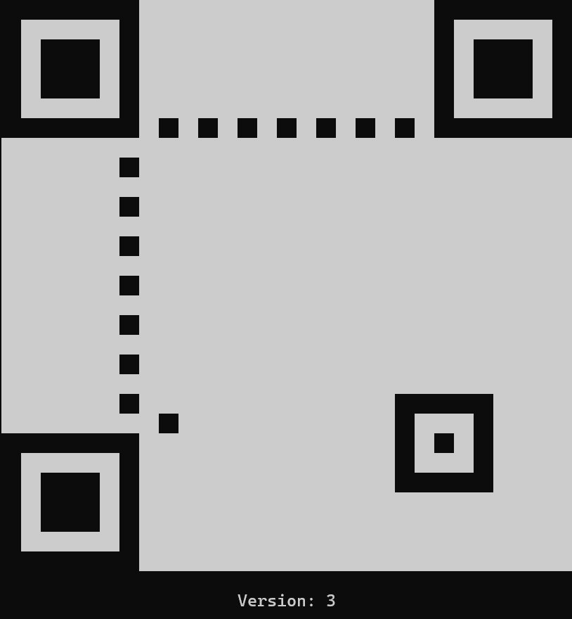

# QR code generator

## Overview

This project is a QR code generator written in Rust. It allows users to create QR codes of various versions and error
correction levels.

<div style="text-align: center;">
  
  <div>
    <text>
       An empty QR Code version 8 rendered in the terminal.
    </text>
  </div>
</div>

## TODO

- [x] add the timing patterns
- [x] add the dark module
- [x] add the format information
- [x] add the version information
- [x] fill the qr code with the data
- [x] implement error correction algorithm to match EC levels
- [ ] interleave codewords
- [ ] debug

## Features

- Generate QR codes of different versions
- Support for various error correction levels
- Format QR codes for display

## Ressources

- [Thonky's QR Code Tutorial](https://www.thonky.com/qr-code-tutorial/)

## Installation

To install the project, clone the repository and build it using Cargo:

```sh
git clone https://github.com/doge0420/QR-code-generator.git
cd qrcode
cargo build
cargo run
```