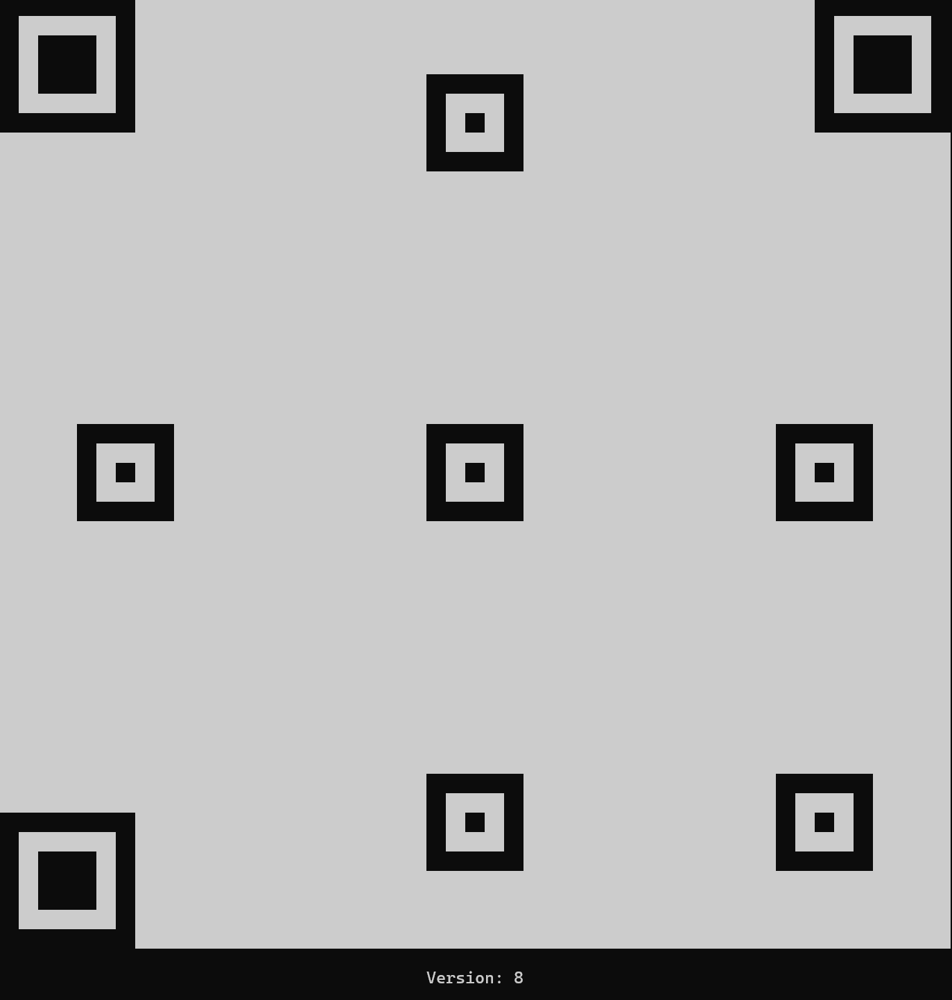

# QR code generator

## Overview

This project is a QR code generator written in Rust. It allows users to create QR codes of various versions and error
correction levels. The project includes functionality for drawing alignment patterns, formatting QR codes for display,
and validating QR code versions.

<div style="text-align: center;">
  
  <div>
    <text>
       An empty QR Code version 8 rendered in the terminal.
    </text>
  </div>
</div>

## TODO

- add the timing patterns
- add the dark module
- add the format information
- fill the qr with the data
- implement error correction algorithm to match EC levels

## Features

- Generate QR codes of different versions
- Support for various error correction levels
- Draw alignment patterns
- Format QR codes for display
- Validate QR code versions

## Ressources

- [Thonky.com's QR Code Tutorial](https://www.thonky.com/qr-code-tutorial/)

## Installation

To install the project, clone the repository and build it using Cargo:

```sh
git clone https://github.com/doge0420/QR-code-generator
cd qrcode
cargo build
cargo run